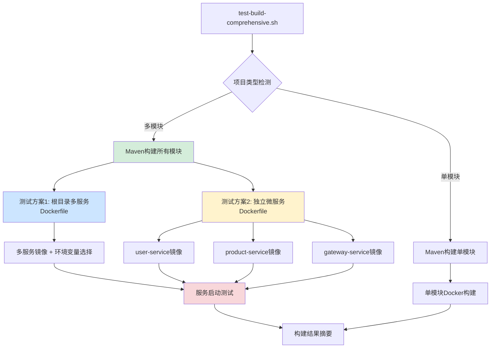

# 微服务Docker构建完整指南

## 📖 概述

本指南详细介绍了如何为Spring Boot微服务项目配置Docker构建环境，包括多模块Maven项目的构建策略、多种Dockerfile配置方案，以及完整的CI/CD集成。

## 🎯 适用场景

- Spring Boot多模块微服务项目
- Maven构建管理
- Docker容器化部署
- GitHub Actions CI/CD
- WSL2开发环境

## 🏗 项目架构

### 项目结构
```
monolith-app/
├── pom.xml                    # 父项目POM
├── Dockerfile                 # 多服务构建Dockerfile
├── user-service/
│   ├── pom.xml
│   ├── src/
│   └── Dockerfile            # 独立构建Dockerfile
├── product-service/
│   ├── pom.xml
│   ├── src/
│   └── Dockerfile            # 独立构建Dockerfile
├── gateway-service/
│   ├── pom.xml
│   ├── src/
│   └── Dockerfile            # 独立构建Dockerfile
└── test-build-comprehensive.sh  # 综合构建测试脚本
```

### 现在的Docker构建架构



## 🐳 Docker构建策略

### 方案1: 多服务单镜像（根目录Dockerfile）

**特点**：
- 一个Dockerfile构建包含所有微服务的镜像
- 通过环境变量选择启动的服务
- 减少镜像数量，简化管理
- 包含单体应用源码（src/目录）和微服务代码

**适用场景**：
- 开发和测试环境
- 资源受限的环境
- 快速原型验证

**根目录Dockerfile配置**：
```dockerfile
# ---- 构建阶段 (Build Stage) ----
FROM maven:3.8-openjdk-8 AS builder

WORKDIR /app

# 复制父项目pom.xml
COPY pom.xml .

# 复制所有子模块目录
COPY user-service/ ./user-service/
COPY product-service/ ./product-service/
COPY gateway-service/ ./gateway-service/

# 复制根目录的src（单体应用源码）
COPY src/ ./src/

# 执行打包命令 - 只打包子模块，跳过父项目
RUN mvn clean package -DskipTests -pl user-service,product-service,gateway-service

# ---- 运行阶段 (Runtime Stage) ----
FROM openjdk:8-jre-slim

WORKDIR /app

# 复制所有微服务的jar文件
COPY --from=builder /app/user-service/target/*.jar user-service.jar
COPY --from=builder /app/product-service/target/*.jar product-service.jar
COPY --from=builder /app/gateway-service/target/*.jar gateway-service.jar

# 创建智能启动脚本
RUN cat > start.sh << 'EOF'
#!/bin/bash
SERVICE_NAME=${SERVICE_NAME:-user-service}
case $SERVICE_NAME in
  "user-service")
    echo "Starting User Service..."
    exec java $JAVA_OPTS -jar user-service.jar
    ;;
  "product-service")
    echo "Starting Product Service..."
    exec java $JAVA_OPTS -jar product-service.jar
    ;;
  "gateway-service")
    echo "Starting Gateway Service..."
    exec java $JAVA_OPTS -jar gateway-service.jar
    ;;
  *)
    echo "Unknown service: $SERVICE_NAME"
    echo "Available services: user-service, product-service, gateway-service"
    exit 1
    ;;
esac
EOF

# 设置脚本权限
RUN chmod +x start.sh

ENV JAVA_OPTS="-Xmx512m -Xms256m"
ENV SERVICE_NAME="user-service"

# 暴露端口（默认user-service端口，其他服务通过端口映射）
EXPOSE 8080

ENTRYPOINT ["./start.sh"]
```

**使用方式**：
```bash
# 构建镜像
docker build -t microservices:latest .

# 启动不同服务
docker run -e SERVICE_NAME=user-service -p 8081:8080 microservices:latest
docker run -e SERVICE_NAME=product-service -p 8082:8080 microservices:latest
docker run -e SERVICE_NAME=gateway-service -p 9090:8080 microservices:latest
```

### 方案2: 独立微服务镜像

**特点**：
- 每个微服务独立的Dockerfile
- 镜像精简，只包含所需服务
- 支持独立部署和扩展
- 从项目根目录构建，使用-f参数指定Dockerfile

**适用场景**：
- 生产环境
- 微服务独立部署
- 不同服务有不同资源需求

**微服务Dockerfile模板**：
```dockerfile
# 以user-service为例
# 适用于在项目根目录构建：docker build -f user-service/Dockerfile .

# 构建阶段
FROM maven:3.8-openjdk-8 AS builder

WORKDIR /app

# 复制父项目pom.xml
COPY pom.xml .

# 复制所有子模块的pom.xml先（优化缓存）
COPY user-service/pom.xml ./user-service/
COPY product-service/pom.xml ./product-service/
COPY gateway-service/pom.xml ./gateway-service/

# 下载依赖（缓存层）
RUN mvn dependency:go-offline -pl user-service

# 复制user-service源码
COPY user-service/src ./user-service/src

# 构建当前服务
RUN mvn clean package -DskipTests -pl user-service

# 运行阶段 - 使用轻量级的OpenJDK 8运行时
FROM openjdk:8-jre-slim

LABEL maintainer="microservices-team"
LABEL service="user-service"
LABEL version="1.0.0"

# 创建非root用户
RUN groupadd -r appuser && useradd -r -g appuser appuser

WORKDIR /app

# 从构建阶段复制JAR文件
COPY --from=builder /app/user-service/target/user-service-*.jar app.jar

RUN chown appuser:appuser app.jar

EXPOSE 8081

# 设置时区
ENV TZ=Asia/Shanghai
RUN ln -snf /usr/share/zoneinfo/$TZ /etc/localtime && echo $TZ > /etc/timezone

# JVM参数
ENV JAVA_OPTS="-Xmx512m -Xms256m -XX:+UseG1GC -XX:+PrintGCDetails -XX:+PrintGCTimeStamps"

USER appuser

# 健康检查
HEALTHCHECK --interval=30s --timeout=3s --start-period=60s --retries=3 \
    CMD curl -f http://localhost:8081/actuator/health || exit 1

ENTRYPOINT ["sh", "-c", "java $JAVA_OPTS -jar app.jar"]
```

**构建命令**：
```bash
# 从项目根目录构建各个微服务
docker build -f user-service/Dockerfile -t user-service:latest .
docker build -f product-service/Dockerfile -t product-service:latest .
docker build -f gateway-service/Dockerfile -t gateway-service:latest .
```

### ❗ 重要说明：Docker构建上下文

**根目录构建的原因**：
- 微服务需要访问父项目pom.xml和其他子模块的pom.xml
- Docker构建上下文必须包含所有依赖文件
- 使用`-f`参数指定不同位置的Dockerfile

**正确的构建方式**：
```bash
# ✅ 正确 - 从根目录构建，使用-f指定Dockerfile
docker build -f user-service/Dockerfile -t user-service:latest .

# ❌ 错误 - 进入子目录构建，缺少上下文
cd user-service && docker build -t user-service:latest .

## 🔧 构建测试工具

### 综合构建测试脚本

我们提供了一个功能强大的测试脚本 `test-build-comprehensive.sh`，支持：

**核心功能**：
- ✅ 自动项目类型检测（单模块/多模块）
- ✅ WSL2权限问题自动修复
- ✅ Maven构建测试
- ✅ 多种Docker构建方案验证
- ✅ 服务启动功能测试
- ✅ 详细的构建报告

**使用方法**：
```bash
# 基本用法
chmod +x test-build-comprehensive.sh
./test-build-comprehensive.sh

# 常用选项
./test-build-comprehensive.sh --help          # 查看帮助
./test-build-comprehensive.sh --verbose       # 详细输出
./test-build-comprehensive.sh --wsl2-fix      # WSL2权限修复
./test-build-comprehensive.sh --skip-maven    # 跳过Maven测试
./test-build-comprehensive.sh --skip-docker   # 跳过Docker测试
```

**脚本执行流程**：
1. **环境检查**: 验证Docker、Maven等依赖
2. **项目分析**: 检测项目类型和结构
3. **权限修复**: WSL2环境权限处理（可选）
4. **Maven构建**: 编译和打包所有模块
5. **Docker测试**: 验证多种构建方案
6. **服务测试**: 启动容器验证功能
7. **结果报告**: 生成详细的构建摘要

## 🚀 CI/CD集成

### GitHub Actions配置

项目包含完整的GitHub Actions工作流 `.github/workflows/docker-build.yml`：

**主要特性**：
- 自动触发条件：push到main/master/develop分支，或打标签
- 多平台构建：linux/amd64, linux/arm64
- 智能缓存：Maven依赖和Docker层缓存
- 安全扫描：Trivy镜像漏洞扫描
- 并行构建：同时构建多个微服务
- 自动推送：GitHub Container Registry

**工作流程**：
```yaml
# 主应用构建
- 检出代码
- 设置JDK 8
- 缓存Maven依赖
- Maven编译和打包
- Docker构建和推送
- 安全扫描

# 微服务并行构建
- 同时构建user-service、product-service、gateway-service
- 推送到ghcr.io/username/repository/service-name
```

**镜像命名规范**：
```
# 主应用
ghcr.io/username/monolith-app:main
ghcr.io/username/monolith-app:v1.0.0

# 微服务
ghcr.io/username/monolith-app/user-service:main
ghcr.io/username/monolith-app/product-service:main
ghcr.io/username/monolith-app/gateway-service:main
```

## 🛠 开发环境配置

### WSL2环境优化

**权限问题解决**：
```bash
# 自动权限修复
./test-build-comprehensive.sh --wsl2-fix

# 手动修复
find . -name "*.yml" -o -name "*.yaml" -o -name "*.properties" | xargs chmod 644
find . -type d | xargs chmod 755
chmod -R 755 .
```

**推荐工作流程**：
```bash
# 1. 复制项目到WSL2文件系统（推荐）
cp -r /mnt/d/workstation/training/monolith-app ~/monolith-app
cd ~/monolith-app

# 2. 运行构建测试
chmod +x test-build-comprehensive.sh
./test-build-comprehensive.sh --wsl2-fix --verbose

# 3. 推送到GitHub触发CI/CD
git add .
git commit -m "ci: 优化Docker构建配置"
git push origin main
```

### 本地开发测试

**快速验证流程**：
```bash
# 1. Maven构建
mvn clean package -DskipTests -pl user-service,product-service,gateway-service

# 2. Docker构建测试
docker build -t test-multi-service:latest .

# 3. 服务启动测试
docker run -d --name test-user -e SERVICE_NAME=user-service -p 8081:8080 test-multi-service:latest
docker run -d --name test-product -e SERVICE_NAME=product-service -p 8082:8080 test-multi-service:latest
docker run -d --name test-gateway -e SERVICE_NAME=gateway-service -p 9090:8080 test-multi-service:latest

# 4. 验证服务
curl http://localhost:8081/actuator/health
curl http://localhost:8082/actuator/health
curl http://localhost:9090/actuator/health

# 5. 清理
docker stop test-user test-product test-gateway
docker rm test-user test-product test-gateway
```

## 📊 性能优化建议

### 构建优化

**Maven构建优化**：
```bash
# 并行构建
mvn clean package -T 1C -pl user-service,product-service,gateway-service

# 离线模式（依赖已下载）
mvn clean package -o -pl user-service,product-service,gateway-service

# 跳过测试
mvn clean package -DskipTests -pl user-service,product-service,gateway-service
```

**Docker构建优化**：
```dockerfile
# 多阶段构建减少镜像大小
FROM maven:3.8-openjdk-8 AS builder
# ... 构建阶段

FROM openjdk:8-jre-slim
# ... 运行阶段（只包含运行时）

# 使用.dockerignore排除不需要的文件
# .dockerignore内容：
target/
.git/
*.md
.gitignore
```

### 镜像优化

**大小优化**：
- 使用 `openjdk:8-jre-slim` 基础镜像
- 多阶段构建，只复制必要文件
- 合并RUN指令减少层数

**安全优化**：
- 创建非root用户运行应用
- 设置合适的文件权限
- 定期更新基础镜像

**运行时优化**：
```dockerfile
ENV JAVA_OPTS="-Xmx512m -Xms256m -XX:+UseG1GC -XX:+PrintGCDetails"
HEALTHCHECK --interval=30s --timeout=3s --start-period=60s --retries=3
```

## 🔍 故障排查

### GitHub Actions构建失败修复 🔧

#### 问题分析

**本地构建成功 ✅**  
本地构建使用正确的构建方式：
```bash
# 从根目录构建，使用 -f 参数指定Dockerfile位置
docker build -f "$service/Dockerfile" -t "test-$service:latest" . --no-cache
```

**GitHub Actions 失败 ❌**  
错误配置：
```yaml
context: ./${{ matrix.service }}  # 错误：子目录作为构建上下文
file: ./${{ matrix.service }}/Dockerfile
```

错误原因：进入子目录构建缺少父项目依赖，无法访问根目录的 `pom.xml` 和其他微服务模块。

#### 修复方案

**1. 修改构建上下文**
```yaml
# 修复前
context: ./${{ matrix.service }}

# 修复后
context: .  # 从根目录构建
```

**2. 修改编译方式**
```yaml
# 修复前
run: |
  cd ${{ matrix.service }}
  mvn clean package -B -DskipTests=true

# 修复后  
run: |
  # 从根目录编译指定模块（与本地构建方式一致）
  mvn clean package -B -DskipTests=true -pl ${{ matrix.service }}
```

#### 关键原因 📋

Spring Boot微服务项目的Dockerfile需要访问：
1. **父项目pom.xml** - 多模块项目依赖管理
2. **其他微服务pom.xml** - 依赖解析和下载
3. **完整的项目结构** - Maven模块化构建

#### 构建方式对比

| 构建方式 | 本地测试 | GitHub Actions修复前 | GitHub Actions修复后 |
|---------|---------|-------------------|-------------------|
| 构建上下文 | 根目录(.) | 子目录(./$service) | 根目录(.) ✅ |
| Dockerfile路径 | -f $service/Dockerfile | ./$service/Dockerfile | ./$service/Dockerfile |
| Maven编译 | -pl $service | cd $service && mvn | -pl $service ✅ |
| 结果 | ✅ 成功 | ❌ 失败 | ✅ 成功 |

#### 验证方式 ✅

推送代码后GitHub Actions应该能够成功构建所有微服务镜像：
```bash
git add .
git commit -m "fix: 修复GitHub Actions微服务构建上下文问题"
git push origin main
```

### 常见问题

**1. Maven构建失败**
```bash
# 检查Java版本
java -version
mvn -version

# 清理并重新构建
mvn clean
./test-build-comprehensive.sh --verbose
```

**2. Docker构建失败**
```bash
# 检查Dockerfile语法
docker build -t test . --no-cache

# 查看构建日志
./test-build-comprehensive.sh --verbose
```

**3. WSL2权限问题**
```bash
# 自动修复
./test-build-comprehensive.sh --wsl2-fix

# 迁移到WSL2文件系统
cp -r /mnt/d/path/to/project ~/project
cd ~/project
```

**4. 服务启动失败**
```bash
# 查看容器日志
docker logs container-name

# 检查端口占用
netstat -tulpn | grep :9090
```

### 调试技巧

**详细构建日志**：
```bash
# Maven详细输出
mvn clean package -X

# Docker详细输出
docker build -t test . --progress=plain --no-cache
```

**交互式调试**：
```bash
# 进入构建中的容器
docker run -it --rm maven:3.8-openjdk-8 bash

# 进入运行中的容器
docker exec -it container-name bash
```

## 📚 最佳实践

### 开发流程

1. **本地开发**：使用综合测试脚本验证构建
2. **代码提交**：确保本地测试通过
3. **推送触发**：GitHub Actions自动构建和测试
4. **版本发布**：使用标签触发生产镜像构建

### 版本管理

```bash
# 开发版本
git commit -m "feat: 新增用户服务功能"
git push origin develop

# 发布版本
git tag v1.0.0
git push origin v1.0.0
```

### 监控和维护

- 定期运行构建测试
- 监控镜像大小变化
- 更新基础镜像和依赖版本
- 关注安全漏洞扫描结果

## 🎯 总结

通过本指南，您可以：

1. ✅ **理解多种Docker构建策略**的适用场景
2. ✅ **掌握完整的构建测试流程**
3. ✅ **解决WSL2环境的常见问题**
4. ✅ **实现自动化CI/CD流水线**
5. ✅ **优化构建性能和镜像质量**

项目提供的工具和配置可以直接用于生产环境，支持从开发到部署的完整DevOps流程。

---

**📞 技术支持**

如果在使用过程中遇到问题，请：
1. 运行 `./test-build-comprehensive.sh --verbose` 获取详细日志
2. 检查GitHub Actions构建日志
3. 参考本文档的故障排查章节
4. 查看项目README文档获取更多信息