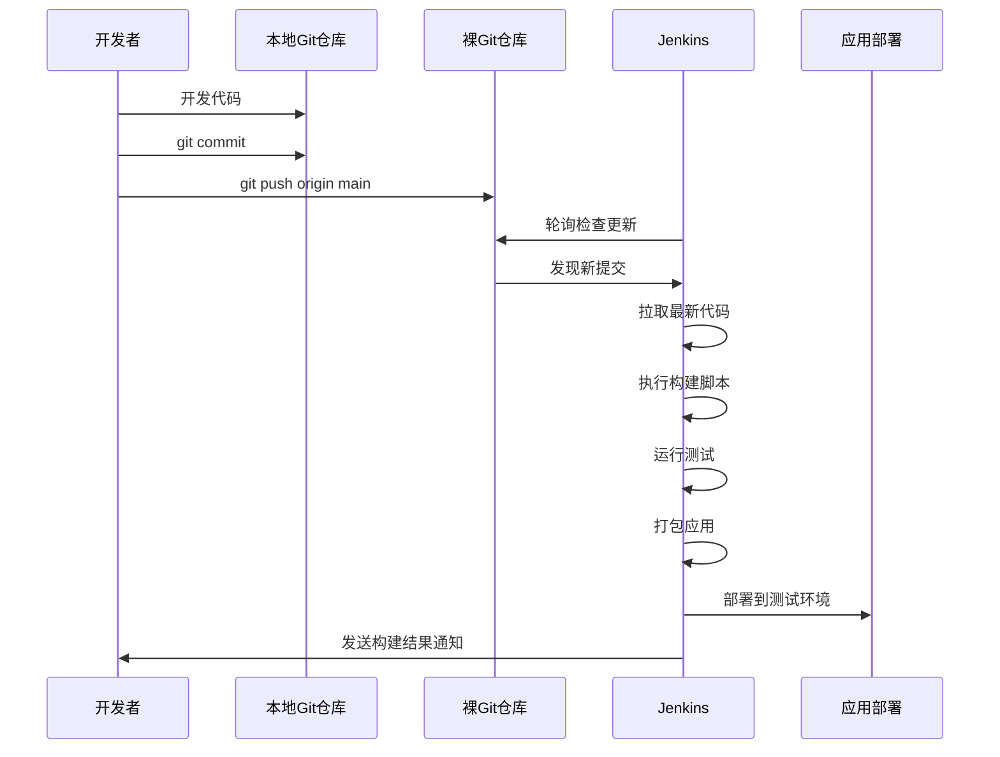
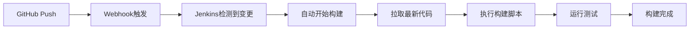

# Jenkins 本地Git仓库配置指南

## 概述

在本地开发环境中使用Jenkins进行CI/CD时，由于项目没有提交到远程GitHub仓库，我们需要配置Jenkins访问本地Git仓库。

## 解决方案

### 方案一：使用本地Git仓库（推荐）

#### 1. 确保项目是Git仓库

检查当前项目是否已经是Git仓库：

```bash
cd d:\workstation\training\monolith-app
git status
```

如果不是Git仓库，需要初始化：

```bash
git init
git add .
git commit -m "Initial commit - microservices project"
```

#### 2. 创建本地裸仓库（Bare Repository）

为了让Jenkins访问，我们需要创建一个裸仓库：

```bash
# 创建裸仓库目录
mkdir D:\git-repos
cd D:\git-repos

# 创建裸仓库
git clone --bare d:\workstation\training\monolith-app monolith-app.git
```

#### 3. 配置Jenkins访问本地仓库

在Jenkins项目配置中：

- **Repository URL**: `file:///D:/git-repos/monolith-app.git`
- **Credentials**: 通常不需要，因为是本地访问
- **Branch**: `*/main` 或 `*/master`

#### 4. 更新本地仓库到裸仓库

当您在开发目录做了修改并提交后，需要推送到裸仓库：

```bash
cd d:\workstation\training\monolith-app

# 添加裸仓库作为remote
git remote add origin file:///D:/git-repos/monolith-app.git

# 推送更改
git push origin main
```

### 方案二：使用文件系统路径（简单但有限制）

#### Jenkins配置

在某些情况下，Jenkins可以直接访问文件系统路径：

- **Repository URL**: `file:///d:/workstation/training/monolith-app`
- **注意**: 这种方式可能在某些Jenkins版本中不稳定

### 方案三：创建GitHub仓库（推荐用于学习）

#### 1. 创建GitHub仓库

1. 登录GitHub.com
2. 点击 "New repository"
3. 仓库名称: `microservices-training`
4. 设置为Public（或Private）
5. 不要初始化README（因为本地已有代码）

#### 2. 推送到GitHub

```bash
cd d:\workstation\training\monolith-app

# 添加GitHub远程仓库
git remote add origin https://github.com/YOUR_USERNAME/microservices-training.git

# 推送代码
git push -u origin main
```

#### 3. Jenkins配置

- **Repository URL**: `https://github.com/YOUR_USERNAME/microservices-training.git`
- **Credentials**: 如果是私有仓库需要配置GitHub token

## 📋 Jenkins配置步骤详解（GitHub方案）

### 1. 创建Freestyle项目

1. 登录Jenkins控制台
2. 点击 "New Item"
3. 输入项目名称: `microservices-ci`
4. 选择 "Freestyle project"
5. 点击 "OK"

### 2. 源码管理配置

```mermaid
flowchart TD
    A[选择Source Code Management] --> B[选择Git选项]
    B --> C[填写GitHub仓库地址]
    C --> D{仓库类型}
    D -->|公开仓库| E[选择"- none -"]
    D -->|私有仓库| F[选择GitHub Token凭据]
    
    C --> G[Repository URL<br/>https://github.com/username/repo.git]
    E --> H[配置分支: */main]
    F --> H
    
    H --> I[保存配置]
    
    style G fill:#e1f5fe
    style H fill:#f3e5f5
```

#### 具体配置项：

- **Repository URL**: `https://github.com/YOUR_USERNAME/YOUR_REPO_NAME.git`
- **Credentials**: 
  - 公开仓库：选择 "- none -"
  - 私有仓库：选择之前创建的GitHub Token凭据
- **Branches to build**: `*/main` (或您的主分支名称)
- **Repository browser**: 可选择 "githubweb" 便于查看

### 3. 构建触发器配置

推荐配置选项：

- ✅ **Poll SCM**: `H/5 * * * *` (每5分钟检查一次代码变更)
- ✅ **GitHub hook trigger for GITScm polling**: 支持Webhook触发
- ⚙️ **Build periodically**: 可选，例如 `H 2 * * *` (每天凌晨2点)

### 4. 构建环境配置

建议勾选：
- ✅ **Delete workspace before build starts**: 确保干净的构建环境
- ✅ **Add timestamps to the Console Output**: 便于调试

### 5. 构建步骤配置

#### Windows环境构建步骤：

选择 "Execute Windows batch command"：

```batch
@echo off
echo ==========================================
echo Starting Microservices Build Pipeline
echo ==========================================

:: 显示Java和Maven版本
echo Checking Java version...
java -version

echo Checking Maven version...
mvn -version

:: 构建gateway-service
echo.
echo Building Gateway Service...
cd gateway-service
call mvn clean compile
if %ERRORLEVEL% NEQ 0 (
    echo Gateway Service build failed!
    exit /b 1
)
cd ..

:: 构建user-service
echo.
echo Building User Service...
cd user-service
call mvn clean compile
if %ERRORLEVEL% NEQ 0 (
    echo User Service build failed!
    exit /b 1
)
cd ..

:: 构建product-service
echo.
echo Building Product Service...
cd product-service
call mvn clean compile
if %ERRORLEVEL% NEQ 0 (
    echo Product Service build failed!
    exit /b 1
)
cd ..

:: 运行测试
echo.
echo Running Tests...
cd user-service
call mvn test
cd ..
cd product-service
call mvn test
cd ..

:: 打包所有服务
echo.
echo Packaging Services...
call mvn clean package -DskipTests

echo.
echo ==========================================
echo Build Pipeline Completed Successfully!
echo ==========================================
```

#### Linux/WSL构建步骤：

```bash
#!/bin/bash
echo "Starting microservices build..."

# 清理和编译
mvn clean compile

# 运行测试
mvn test

# 打包
mvn package -DskipTests

# 构建Docker镜像
if [ -f docker-compose.yml ]; then
    echo "Building Docker images..."
    docker-compose build
fi

echo "Build completed successfully!"
```

## 完整工作流程



## 推荐配置

### ✅ 使用GitHub仓库（当前推荐方案）

**您已经将代码推送到GitHub，这是最佳的CI/CD实践方案！**

#### Jenkins配置步骤：

1. **获取GitHub仓库地址**
   - 格式: `https://github.com/YOUR_USERNAME/REPOSITORY_NAME.git`
   - 例如: `https://github.com/username/microservices-training.git`

2. **在Jenkins中配置Source Code Management**
   ```
   Repository URL: https://github.com/YOUR_USERNAME/YOUR_REPO_NAME.git
   Credentials: 
     - 如果是公开仓库：选择 "- none -"
     - 如果是私有仓库：需要配置GitHub Token
   Branches to build: */main (或 */master)
   ```

3. **配置GitHub凭据（如果是私有仓库）**
   - 在Jenkins中添加Credentials
   - Kind: "Username with password"
   - Username: 您的GitHub用户名
   - Password: GitHub Personal Access Token

#### GitHub Token配置（私有仓库需要）：

1. **创建GitHub Personal Access Token**
   - 访问: https://github.com/settings/tokens
   - 点击 "Generate new token (classic)"
   - 选择权限: `repo` (Full control of private repositories)
   - 复制生成的token

2. **在Jenkins中添加凭据**
   - Jenkins Dashboard → Manage Jenkins → Manage Credentials
   - 选择 "(global)" domain
   - 点击 "Add Credentials"
   - Kind: "Username with password"
   - Username: 您的GitHub用户名
   - Password: 刚才复制的token
   - ID: `github-token` (便于识别)
   - Description: "GitHub Personal Access Token"

#### 自动触发构建配置：



**优势**：
- ✅ 真实的CI/CD环境
- ✅ 支持Webhook自动触发
- ✅ 完整的版本控制历史
- ✅ 更好的Jenkins集成
- ✅ 支持团队协作

## 下一步操作

1. ✅ 选择适合的Git仓库方案
2. ✅ 配置Jenkins项目的Source Code Management
3. ✅ 设置构建触发器
4. ✅ 编写构建脚本
5. ✅ 测试整个CI/CD流程

## 常见问题解决

### Q: Jenkins无法访问本地Git仓库
**A**: 检查路径格式，Windows下使用 `file:///D:/path` 格式

### Q: 推送到裸仓库失败
**A**: 确保裸仓库路径正确，使用 `git remote -v` 检查配置

### Q: Jenkins构建失败
**A**: 检查Jenkins工作空间权限，确保Maven/Java环境配置正确

---

**选择最适合您当前需求的方案，我可以为您提供详细的配置步骤指导！**