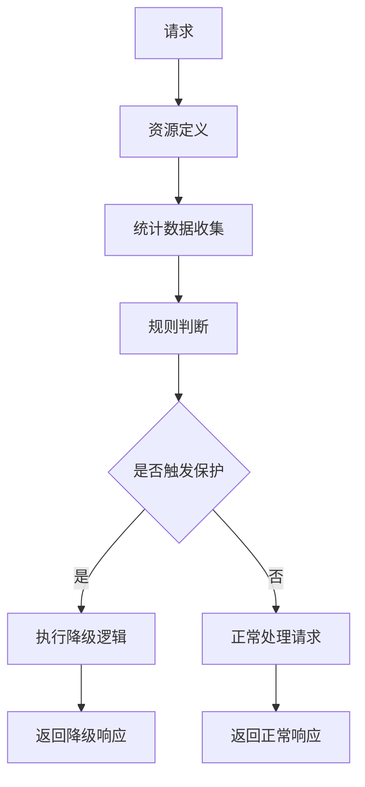
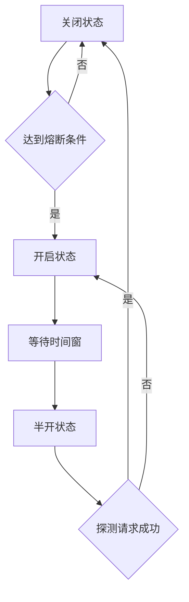

# 🛡️ Sentinel 完整使用指南

## 目录
- [1. 环境准备](#1-环境准备)
- [2. Sentinel 基础概念](#2-sentinel-基础概念)  
- [3. 实战演示步骤](#3-实战演示步骤)
- [4. 流量控制详解](#4-流量控制详解)
- [5. 熔断降级详解](#5-熔断降级详解)
- [6. 热点参数限流](#6-热点参数限流)
- [7. OpenFeign 集成](#7-openfeign-集成)
- [8. 规则持久化](#8-规则持久化)
- [9. 生产环境建议](#9-生产环境建议)
- [10. 故障排查](#10-故障排查)

---

## 1. 环境准备

### 1.1 启动顺序

1. **启动 Nacos 服务器** (已启动)
   - 地址: http://172.24.238.72:8848

2. **下载并启动 Sentinel Dashboard**
   ```bash
   # 优先推荐 Docker 方式
   docker run -d -p 8858:8080 --name sentinel-dashboard bladex/sentinel-dashboard:1.8.6
   
   # 或下载 sentinel-dashboard-1.8.6.jar 到项目根目录
   # 然后运行启动脚本
   .\start-sentinel-dashboard.bat
   ```

3. **启动微服务**
   ```bash
   # 运行测试脚本
   .\test-sentinel-integration.bat
   ```

### 1.2 验证环境

- ✅ Sentinel Dashboard: http://localhost:8858 (sentinel/sentinel)
- ✅ User Service: http://localhost:8081/api/sentinel/status  
- ✅ Product Service: http://localhost:8082/api/sentinel/status
- ✅ Nacos Console: http://172.24.238.72:8848/nacos

---

## 2. Sentinel 基础概念

### 2.1 核心概念

| 概念 | 说明 | 示例 |
|------|------|------|
| **资源** | 被保护的对象 | API接口、方法、代码块 |
| **规则** | 保护资源的策略 | 流控、熔断、热点参数 |
| **指标** | 资源的统计数据 | QPS、RT、异常率 |
| **槽位链** | 处理请求的链路 | 统计→规则→降级 |

### 2.2 保护机制



---

## 3. 实战演示步骤

### 3.1 第一步：观察资源

1. 访问测试接口，让服务注册到 Sentinel
   ```bash
   curl http://localhost:8081/api/sentinel/test
   curl http://localhost:8082/api/sentinel/test
   ```

2. 在 Sentinel Dashboard 中查看:
   - **实时监控** → 查看 QPS、RT 等指标
   - **簇点链路** → 查看资源列表

### 3.2 第二步：配置流控规则

1. 进入 **流控规则** 页面
2. 点击 **新增流控规则**
3. 配置参数:
   ```
   资源名: user-test
   阈值类型: QPS  
   单机阈值: 2
   流控模式: 直接
   流控效果: 快速失败
   ```

### 3.3 第三步：测试流控效果

快速访问接口，观察限流：
```bash
# 快速多次请求
for i in {1..10}; do curl http://localhost:8081/api/sentinel/test; echo; done
```

**预期结果**: 超过 QPS=2 的请求被拒绝，返回降级响应。

---

## 4. 流量控制详解

### 4.1 阈值类型

| 类型 | 说明 | 使用场景 |
|------|------|----------|
| **QPS** | 每秒查询率 | 接口访问频率控制 |
| **线程数** | 并发线程数 | 慢接口保护 |

### 4.2 流控模式

#### 4.2.1 直接流控
```yaml
# 最简单的流控，直接对当前资源限流
resource: user-test
threshold: 2 QPS
effect: 快速失败
```

#### 4.2.2 关联流控  
```yaml
# 当关联资源达到阈值时，限流当前资源
resource: user-query
关联资源: user-write  
threshold: 10 QPS
说明: 当写操作过多时，限制查询操作
```

#### 4.2.3 链路流控
```yaml  
# 只对特定入口的调用链路生效
resource: common-method
入口资源: /api/user/list
threshold: 5 QPS  
说明: 只限制通过用户列表接口调用的通用方法
```

### 4.3 流控效果

#### 4.3.1 快速失败
- **行为**: 立即抛出 FlowException
- **适用**: 对响应时间敏感的场景

#### 4.3.2 Warm Up (预热)
- **行为**: 缓慢增加流量直到设定阈值
- **参数**: 预热时长 (秒)
- **适用**: 系统启动场景

#### 4.3.3 排队等待
- **行为**: 请求排队，匀速通过  
- **参数**: 超时时间 (毫秒)
- **适用**: 削峰填谷场景

### 4.4 实战配置示例

```bash
# 测试不同流控效果

# 1. 快速失败 (默认)
资源: user-test, QPS=2, 快速失败

# 2. 预热模式  
资源: user-slow, QPS=5, Warm Up, 预热时长=10秒

# 3. 排队等待
资源: product-inventory, QPS=1, 排队等待, 超时=5000ms
```

---

## 5. 熔断降级详解

### 5.1 熔断策略

| 策略 | 触发条件 | 使用场景 |
|------|----------|----------|
| **慢调用比例** | 响应时间 > RT且比例 > 阈值 | 依赖服务响应慢 |
| **异常比例** | 异常请求比例 > 阈值 | 业务异常率高 |  
| **异常数** | 异常请求数 > 阈值 | 绝对异常数控制 |

### 5.2 熔断状态机



### 5.3 慢调用比例熔断

**配置示例**:
```yaml
资源名: user-slow
熔断策略: 慢调用比例
最大 RT: 1000ms      # 超过1秒算慢调用
比例阈值: 0.6        # 60%的请求是慢调用时熔断
熔断时长: 10s        # 熔断10秒
最小请求数: 5        # 至少5个请求才统计
统计时长: 1000ms     # 1秒内的统计
```

**测试步骤**:
1. 配置上述熔断规则
2. 访问慢调用接口: `http://localhost:8081/api/sentinel/slow?delay=1200`
3. 快速多次访问，观察熔断效果

### 5.4 异常比例熔断  

**配置示例**:
```yaml
资源名: product-exception
熔断策略: 异常比例  
比例阈值: 0.4        # 40%异常率时熔断
熔断时长: 10s
最小请求数: 5
统计时长: 1000ms
```

**测试步骤**:
1. 配置异常比例熔断规则
2. 访问异常接口: `http://localhost:8082/api/sentinel/exception?errorRate=50`
3. 多次访问，观察熔断和恢复过程

---

## 6. 热点参数限流

### 6.1 概念说明

热点参数限流针对特定参数值进行限流，例如:
- 热门商品ID  
- VIP用户ID
- 特定API Key

### 6.2 配置步骤

1. **进入热点规则页面**

2. **新增热点规则**:
   ```yaml
   资源名: user-hotkey
   参数索引: 0          # 第一个参数 (userId)  
   单机阈值: 2          # 该参数值每秒最多2次请求
   统计窗口时长: 1s
   ```

3. **配置参数例外项** (可选):
   ```yaml
   参数类型: String
   参数值: "vip001"    # VIP用户
   限流阈值: 10        # VIP用户可以10次/秒
   ```

### 6.3 测试热点限流

```bash
# 测试普通用户限流 (2 QPS)
curl http://localhost:8081/api/sentinel/hotkey/user123
curl http://localhost:8081/api/sentinel/hotkey/user123  
curl http://localhost:8081/api/sentinel/hotkey/user123  # 被限流

# 测试VIP用户 (10 QPS)
curl http://localhost:8081/api/sentinel/hotkey/vip001   # 不受限制
```

---

## 7. OpenFeign 集成

### 7.1 添加 Feign 集成依赖

已在现有项目中配置，包含:
- `spring-cloud-starter-openfeign`  
- `spring-cloud-starter-alibaba-sentinel`

### 7.2 启用 Sentinel 对 Feign 的支持

在 `application.yml` 中配置:
```yaml
feign:
  sentinel:
    enabled: true
```

### 7.3 创建 Feign 客户端

```java
@FeignClient(name = "product-service", 
             fallback = ProductServiceFallback.class)
public interface ProductServiceClient {
    
    @GetMapping("/api/sentinel/test")
    String testProduct();
    
    @GetMapping("/api/sentinel/inventory/{productId}")  
    String getInventory(@PathVariable String productId);
}

@Component
public class ProductServiceFallback implements ProductServiceClient {
    
    @Override
    public String testProduct() {
        return "商品服务暂时不可用";
    }
    
    @Override
    public String getInventory(String productId) {
        return "商品库存查询失败，商品ID: " + productId;
    }
}
```

### 7.4 测试服务间容错

1. **正常调用测试**
2. **关闭 product-service**  
3. **观察降级效果**

---

## 8. 规则持久化

### 8.1 问题说明

默认情况下，Sentinel 规则存储在内存中，重启后丢失。

### 8.2 Nacos 持久化方案

#### 8.2.1 添加依赖
```xml
<dependency>
    <groupId>com.alibaba.csp</groupId>
    <artifactId>sentinel-datasource-nacos</artifactId>
</dependency>
```

#### 8.2.2 配置数据源
```yaml
spring:
  cloud:
    sentinel:
      datasource:
        # 流控规则
        flow:
          nacos:
            server-addr: 172.24.238.72:8848
            dataId: ${spring.application.name}-flow-rules
            groupId: SENTINEL_GROUP
            rule-type: flow
        # 熔断规则
        degrade:  
          nacos:
            server-addr: 172.24.238.72:8848
            dataId: ${spring.application.name}-degrade-rules
            groupId: SENTINEL_GROUP
            rule-type: degrade
```

#### 8.2.3 在 Nacos 中创建规则配置

**流控规则示例** (`user-service-flow-rules`):
```json
[
  {
    "resource": "user-test",
    "limitApp": "default", 
    "grade": 1,
    "count": 2,
    "strategy": 0,
    "controlBehavior": 0,
    "clusterMode": false
  }
]
```

---

## 9. 生产环境建议

### 9.1 监控告警

1. **关键指标监控**:
   - 限流QPS  
   - 熔断次数
   - 响应时间

2. **告警配置**:
   - 熔断频率过高
   - 限流比例过高
   - 服务不可用

### 9.2 规则配置建议

| 场景 | 流控建议 | 熔断建议 |
|------|----------|----------|
| **核心接口** | QPS限流 + 预热 | 慢调用比例熔断 |
| **查询接口** | 线程数限流 | 异常比例熔断 |  
| **写入接口** | 排队等待 | 异常数熔断 |
| **外部调用** | 关联限流 | 快速熔断恢复 |

### 9.3 容量规划

```bash
# 根据业务场景设置合理阈值

# 高频查询接口
QPS: 100-500 (根据服务能力)
RT: < 200ms
熔断阈值: 异常率 > 5%

# 核心业务接口  
QPS: 50-200
RT: < 500ms
熔断阈值: 慢调用比例 > 30%

# 批量处理接口
线程数: 5-10
超时时间: 30s
熔断阈值: 异常数 > 10
```

---

## 10. 故障排查

### 10.1 常见问题

#### 10.1.1 服务不出现在 Dashboard

**原因**:
- 服务未访问过，没有产生流量
- Dashboard 地址配置错误
- 端口被占用

**排查步骤**:
```bash
# 1. 确认配置
spring.cloud.sentinel.transport.dashboard=localhost:8858
spring.cloud.sentinel.transport.port=8719

# 2. 访问接口产生流量
curl http://localhost:8081/api/sentinel/test

# 3. 检查端口占用
netstat -ano | findstr 8719
```

#### 10.1.2 规则不生效

**原因**:
- 资源名不匹配
- 阈值设置过大
- 统计时间窗口未满

**排查步骤**:
1. 确认资源名完全一致
2. 查看实时监控数据  
3. 降低阈值进行测试

#### 10.1.3 降级方法未执行

**原因**:
- 方法签名不匹配
- BlockException 参数缺失
- 降级方法不在同一个类

**解决方案**:
```java
// 正确的降级方法签名
@SentinelResource(value = "test", blockHandler = "testBlockHandler")
public String test(String param) {
    return "normal";
}

// blockHandler 方法必须：
// 1. 相同返回类型
// 2. 相同参数 + BlockException
// 3. public static 或 同类实例方法
public String testBlockHandler(String param, BlockException ex) {
    return "blocked";  
}
```

### 10.2 调试技巧

1. **开启调试日志**:
   ```yaml
   logging:
     level:
       com.alibaba.csp.sentinel: DEBUG
   ```

2. **查看规则加载日志**
3. **使用 Actuator 端点**:
   ```bash
   curl http://localhost:8081/actuator/sentinel
   ```

---

## 🎯 学习成果验收

完成本章学习后，你应该能够:

- ✅ 理解微服务容错的重要性和雪崩效应
- ✅ 熟练使用 Sentinel Dashboard 进行可视化配置  
- ✅ 配置各种流控规则保护系统资源
- ✅ 配置熔断降级提升系统稳定性
- ✅ 实现服务间调用的容错保护
- ✅ 应用热点参数限流保护热点数据
- ✅ 解决生产环境中的容错问题

**恭喜你！** 现在已经掌握了微服务容错保护的核心技能。下一章我们将学习 **Spring Cloud Gateway** - 统一API入口！

---

### 📚 延伸阅读

- [Sentinel 官方文档](https://sentinelguard.io/zh-cn/)
- [Spring Cloud Alibaba Sentinel](https://github.com/alibaba/spring-cloud-alibaba/wiki/Sentinel)  
- [微服务容错模式](https://docs.microsoft.com/zh-cn/azure/architecture/patterns/circuit-breaker)