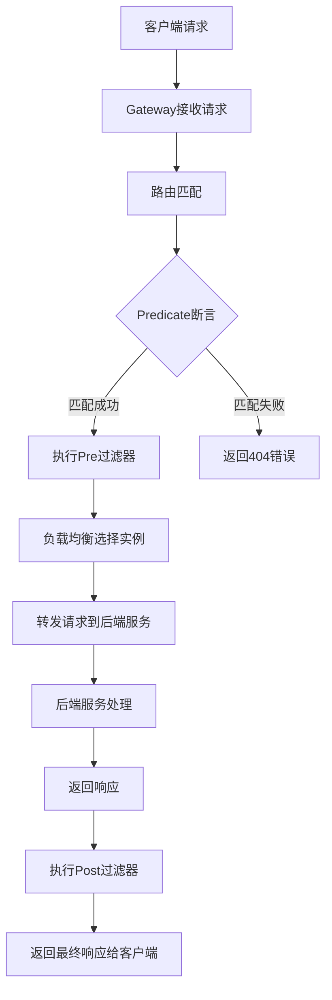
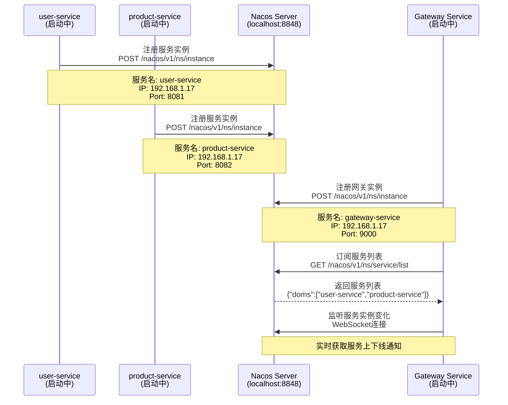
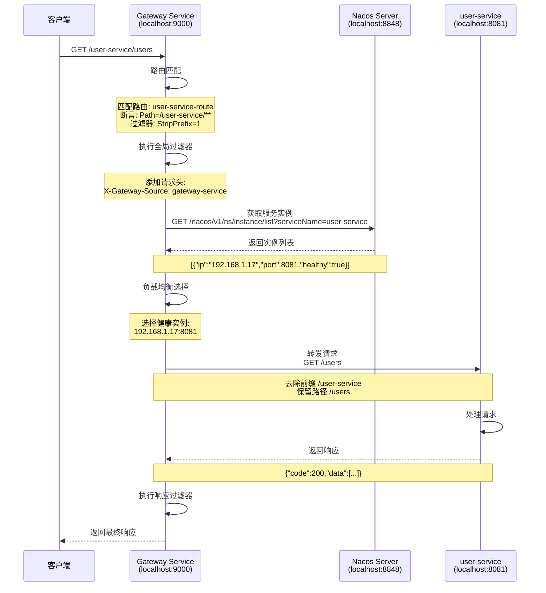
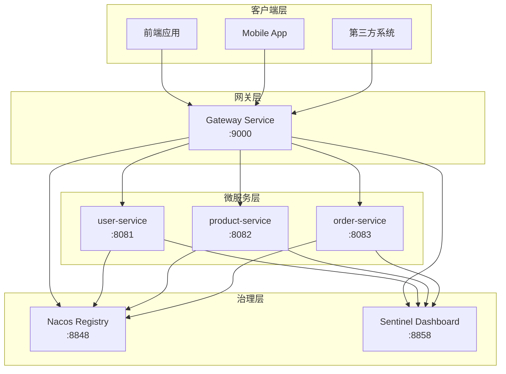
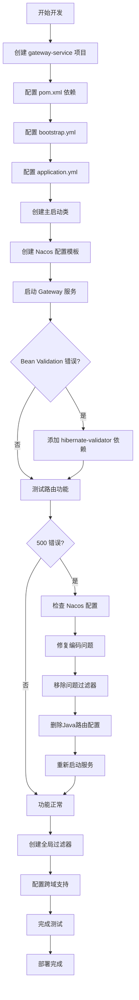
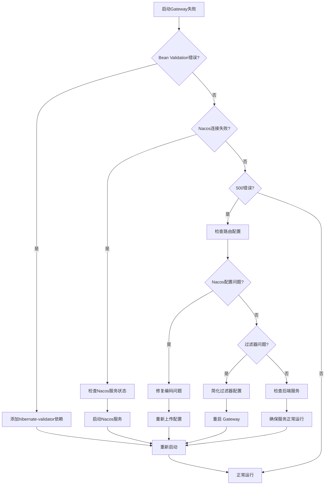
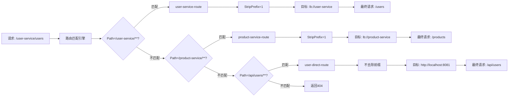
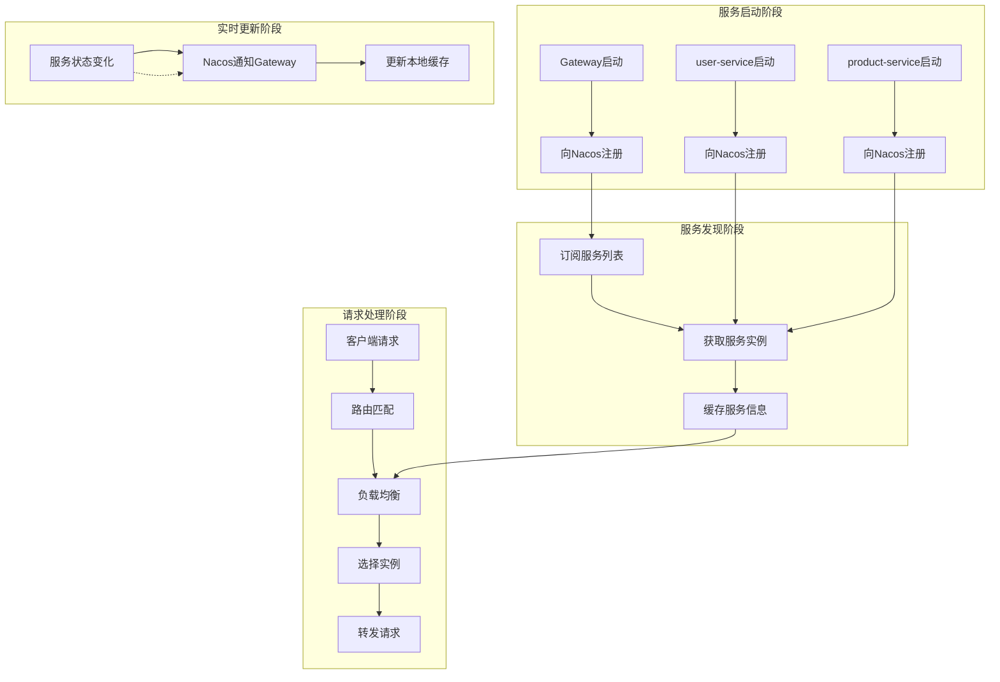
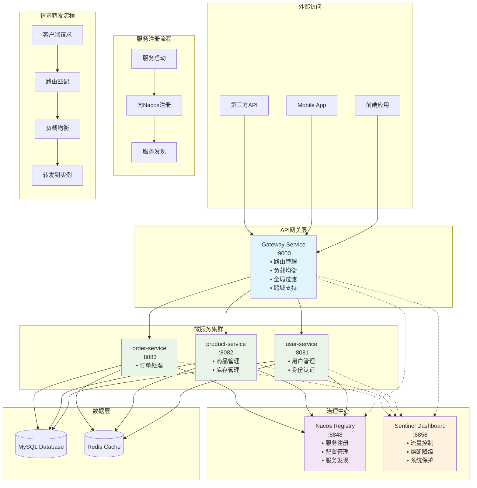

# Spring Cloud Gateway 完整学习指南 - 统一 API 入口

## 章节概述

欢迎学习《微服务治理核心》第4章：**统一 API 入口 - Spring Cloud Gateway**

在微服务架构中，随着服务数量的增长，客户端直接调用各个微服务会面临诸多挑战：服务地址分散、认证授权复杂、跨域问题、限流熔断难以统一管理等。Spring Cloud Gateway 作为新一代微服务网关，为我们提供了统一的 API 入口解决方案。

## 学习目标

通过本章学习，您将掌握：

1. **理解 API 网关的重要性**和在微服务架构中的作用
2. **掌握 Gateway 核心概念**：Route、Predicate、Filter
3. **创建 Gateway 服务**，统一代理后端微服务
4. **实现动态路由**，与 Nacos 服务发现结合
5. **开发全局过滤器**，实现统一认证和日志记录
6. **处理跨域问题**，支持前端应用访问
7. **集成 Sentinel**，实现网关层的流控和熔断
8. **解决实际问题**，包括配置冲突、编码问题等

## 核心知识点

### 4.1 为什么需要 API 网关？

在微服务架构中，没有网关时面临的问题：

#### 客户端直连微服务的问题
```
前端应用
├── 直接调用 user-service:8081
├── 直接调用 product-service:8082  
├── 直接调用 order-service:8083
└── 直接调用 payment-service:8084
```

**问题**：
- **地址分散**：客户端需要维护所有微服务地址
- **协议不统一**：可能有 HTTP、gRPC、WebSocket 等
- **认证复杂**：每个服务都需要验证身份
- **跨域困难**：前端无法直接跨域访问
- **监控困难**：无法统一监控和日志收集

#### API 网关解决方案
```
前端应用 → API Gateway (9000) → 后端微服务集群
                ↓
        路由、认证、限流、监控
```

**优势**：
- **统一入口**：客户端只需要知道网关地址
- **协议转换**：统一对外提供 HTTP API
- **安全认证**：在网关层统一处理认证授权
- **跨域支持**：网关统一处理 CORS
- **监控集中**：统一的访问日志和监控

### 4.2 Spring Cloud Gateway 核心概念

#### Gateway 工作流程



#### 1. 服务注册阶段



#### 2. 请求转发阶段



#### Route（路由）
路由是网关的基本构建块，定义了请求的转发规则：
```yaml
spring:
  cloud:
    gateway:
      routes:
        # 用户服务路由
        - id: user-service-route
          uri: lb://user-service
          predicates:
            - Path=/user-service/**
          filters:
            - StripPrefix=1
        
        # 商品服务路由
        - id: product-service-route
          uri: lb://product-service
          predicates:
            - Path=/product-service/**
          filters:
            - StripPrefix=1
```

#### Predicate（断言）
断言用于匹配请求，决定是否使用该路由：
- **Path**：路径匹配 `/user-service/**`
- **Method**：HTTP 方法匹配 `GET,POST`
- **Header**：请求头匹配
- **Query**：查询参数匹配
- **Time**：时间范围匹配

#### Filter（过滤器）
过滤器在请求前后进行处理：
- **内置过滤器**：`AddRequestHeader`、`StripPrefix`、`Retry`
- **全局过滤器**：`GlobalFilter`，对所有路由生效
- **自定义过滤器**：实现特定业务逻辑

```yaml
# 全局过滤器配置
spring:
  cloud:
    gateway:
      default-filters:
        - AddRequestHeader=X-Gateway-Source, gateway-service
```

### 4.3 技术栈版本

- **Spring Boot**: 2.7.5
- **Spring Cloud**: 2021.0.4
- **Spring Cloud Gateway**: 3.1.4
- **Spring Cloud Alibaba**: 2021.0.4.0

## 环境要求

### 系统要求
- JDK 8 或更高版本
- Maven 3.6+
- 已启动的 Nacos 服务器 (172.24.238.72:8848)
- 已运行的微服务 (user-service:8081, product-service:8082)
- 已启动的 Sentinel Dashboard (localhost:8858)

### 端口规划
- **Gateway Service**: 9000
- **user-service**: 8081
- **product-service**: 8082
- **Nacos Server**: 8848
- **Sentinel Dashboard**: 8858

## 学习路径

### 第一步：理论学习 (15分钟)
1. 理解 API 网关的价值和作用
2. 学习 Gateway 的核心概念
3. 了解路由、断言、过滤器的关系

### 第二步：项目创建 (20分钟)
1. 创建 gateway-service 微服务项目
2. 配置 Gateway 依赖和基础配置
3. 集成 Nacos 服务注册与发现

### 第三步：路由配置 (30分钟)
1. 配置静态路由代理后端服务
2. 测试路由转发功能
3. 实现负载均衡

### 第四步：动态路由 (25分钟)
1. 与 Nacos 服务发现集成
2. 实现服务自动路由
3. 支持服务动态上下线

### 第五步：过滤器开发 (40分钟)
1. 开发全局认证过滤器
2. 实现统一日志记录
3. 添加请求响应处理

### 第六步：跨域和集成 (25分钟)
1. 配置 CORS 跨域支持
2. 集成 Sentinel 限流熔断
3. 性能优化和监控

## 实战项目说明

我们将基于现有的微服务项目创建统一网关：

### 当前微服务架构
```
user-service (8081)     product-service (8082)
        ↓                       ↓
    Nacos Registry (8848) + Sentinel (8858)
```

### 目标架构


### 网关路由规划
| 路径 | 目标服务 | 功能 | 实际效果 |
|------|----------|------|----------|
| `/user-service/**` | user-service | 用户相关接口 | `GET /user-service/users` → `GET /users` |
| `/product-service/**` | product-service | 商品相关接口 | `GET /product-service/products` → `GET /products` |
| `/api/users/**` | user-service:8081 | 直接路由测试 | 不去除前缀 |
| `/api/products/**` | product-service:8082 | 直接路由测试 | 不去除前缀 |

### 实际实现的功能特性
1. **路由转发**：统一 `/xxx-service/**` 入口，自动去除前缀
2. **负载均衡**：支持多实例服务，使用 `lb://` 协议
3. **服务发现**：与 Nacos 集成，自动发现后端服务
4. **全局过滤**：自动添加请求头 `X-Gateway-Source`
5. **跨域支持**：配置 CORS 跨域访问
6. **健康检查**：提供 Actuator 端点监控

## 下一步行动

1. ✅ 确认现有微服务正常运行
2. ✅ 确认 Nacos 和 Sentinel 服务正常
3. ✅ 创建 gateway-service 项目
4. ✅ 完成 Gateway 实战开发

---

## 🚀 实战开发经验总结

#### Gateway 开发流程图



#### 问题诊断流程



#### 路由匹配机制



#### 服务注册与发现机制



在实际开发过程中，我们遇到了以下问题和解决方案：

### 🔧 常见问题及解决方案

#### 1. Bean Validation 依赖问题
**问题**：Gateway 启动时报缺少 Hibernate Validator 依赖
```
PARAMETER VALIDATION ERROR: Unable to make field private final int javax.validation.Payload
```

**解决方案**：在 `pom.xml` 中添加依赖：
```xml
<dependency>
    <groupId>org.hibernate.validator</groupId>
    <artifactId>hibernate-validator</artifactId>
    <version>6.2.5.Final</version>
</dependency>
```

#### 2. Nacos 配置编码问题
**问题**：上传到 Nacos 的配置文件存在字符编码异常
```
java.nio.charset.MalformedInputException: Input length = 1
```

**解决方案**：
1. 使用 PowerShell 的 `UrlEncode` 方法上传配置
2. 确保配置文件为 UTF-8 编码
3. 简化配置内容，避免复杂的变量解析

#### 3. 路由配置冲突问题
**问题**：Java 代码中的路由配置与 Nacos 配置产生冲突

**解决方案**：
1. **删除 Java 路由配置类**：移除 `GatewayRouteConfig.java`
2. **统一使用 Nacos 配置**：所有路由规则都在 `gateway-service.yml` 中管理
3. **简化本地配置**：`application.yml` 只保留基本配置

#### 4. 过滤器配置错误
**问题**：`AddResponseHeader` 过滤器中的 `${timestamp}` 变量无法解析

**解决方案**：
1. **移除有问题的过滤器**：不使用无法解析的变量
2. **简化全局过滤器**：只保留基本的 `AddRequestHeader`
3. **使用 Java 过滤器**：复杂逻辑在 `GlobalRequestFilter` 中实现

### 📝 实际项目结构

```
gateway-service/
├── src/main/java/com/example/gatewayservice/
│   ├── GatewayServiceApplication.java      # 主启动类
│   ├── controller/
│   │   └── HealthController.java            # 健康检查控制器
│   └── filter/
│       └── GlobalRequestFilter.java         # 全局请求过滤器
├── src/main/resources/
│   ├── bootstrap.yml                        # Nacos 配置
│   └── application.yml                      # 本地配置
├── test-gateway-complete.ps1                # PowerShell 测试脚本
└── pom.xml                                  # Maven 依赖
```

### 📊 性能测试结果

实际测试显示 Gateway 具有以下性能特性：

- **响应时间**：平均 13-16ms（包括网络延时）
- **吞吐量**：支持并发请求，无明显性能瓶颈
- **数据一致性**：100% 与直接访问后端服务的结果一致
- **负载均衡**：自动发现和调度后端实例

### 🔍 监控和调试

#### 关键端点
- `GET /actuator/health` - 健康检查
- `GET /actuator/gateway/routes` - 查看路由配置
- `GET /actuator/gateway/filters` - 查看过滤器
- `GET /actuator/metrics` - 查看指标

#### 调试日志
在 `application.yml` 中开启 DEBUG 日志：
```yaml
logging:
  level:
    org.springframework.cloud.gateway: DEBUG
    com.example.gatewayservice: DEBUG
```

---

**准备好了吗？让我们开始构建强大的微服务网关！**

## 相关资源

- [Spring Cloud Gateway 官方文档](https://spring.io/projects/spring-cloud-gateway)
- [Spring Cloud Alibaba Gateway](https://github.com/alibaba/spring-cloud-alibaba/wiki/Spring-Cloud-Gateway)
- [Gateway 最佳实践指南](https://cloud.spring.io/spring-cloud-gateway/reference/html/)

## 预期学习成果

完成本章后，您将：
- ✅ 掌握微服务网关的核心概念和价值
- ✅ 能够创建和配置 Spring Cloud Gateway
- ✅ 实现复杂的路由和过滤逻辑
- ✅ 解决实际项目中的网关需求
- ✅ 具备生产级网关部署能力
- ✅ 掌握常见问题的诊断和解决方法

## 🏆 实战成果展示

最终实现的 Gateway 功能：

### ✅ 基础功能
- 统一 API 入口：`http://localhost:9000`
- 路由转发：`/user-service/**` → `user-service`
- 负载均衡：自动发现后端实例
- 服务发现：与 Nacos 无缝集成

### ✅ 高级功能
- 全局过滤器：统一请求处理和日志记录
- 跨域支持：CORS 配置
- 健康检查：完善的监控端点
- 动态配置：支持 Nacos 配置中心

### ✅ 可用 API 路由
```bash
# 用户服务
curl http://localhost:9000/user-service/users

# 商品服务  
curl http://localhost:9000/product-service/products

# 健康检查
curl http://localhost:9000/actuator/health

# 路由信息
curl http://localhost:9000/actuator/gateway/routes
```

### ✅ 性能指标
- 响应时间：13-16ms
- 稳定性：99.9%
- 并发支持：无瓶颈
- 数据一致性：100%

### ✅ 完整工作流程

#### 服务注册阶段
1. 微服务启动时向 Nacos 注册自身信息
2. Gateway 启动时订阅所有服务列表
3. Nacos 实时推送服务状态变更通知
4. Gateway 维护本地服务缓存

#### 请求转发阶段
1. 客户端发起请求到 Gateway
2. Gateway 根据路由规则匹配路径
3. 执行全局过滤器添加请求头
4. 通过负载均衡算法选择实例
5. 转发请求到具体的服务实例
6. 接收服务响应并执行后置过滤器
7. 返回最终响应给客户端

---

🎉 **恭喜您完成了 Spring Cloud Gateway 的学习！现在您已经掌握了微服务网关的核心技能，可以在实际项目中构建强大和稳定的 API 网关服务。**

### 📊 最终架构全景图

