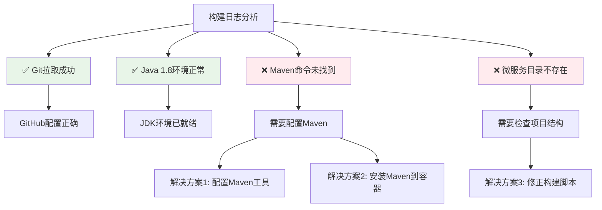
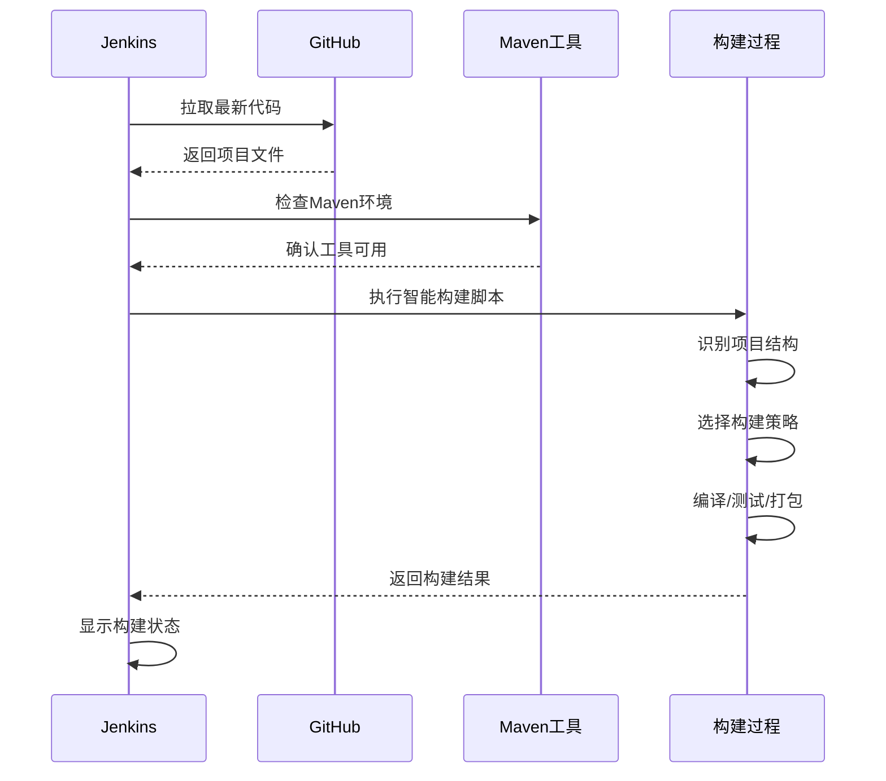

# 🔧 Jenkins 构建问题修复指南

## 📊 问题分析

根据您的构建日志，发现以下问题：



## 🛠️ 修复步骤

### 步骤1: 配置Maven工具（推荐）

1. **打开Jenkins全局工具配置**
   - Dashboard → Manage Jenkins → Global Tool Configuration

2. **配置Maven**
   - 找到 "Maven" 部分
   - 点击 "Add Maven"
   - 配置如下：
     ```
     Name: Maven-3.8.6
     ✅ Install automatically
     Version: 选择最新版本（如3.8.6）
     ```

3. **保存配置**

### 步骤2: 修改项目构建配置

1. **进入项目配置**
   - 项目页面 → Configure

2. **修改Build步骤**
   - 找到 "Build Steps"
   - 在 "Execute shell" 中替换为以下脚本：

```bash
#!/bin/bash

echo "==========================================="
echo "微服务构建流水线 - 智能版"
echo "==========================================="

# 环境检查
echo "🔍 环境检查..."
echo "当前目录: $(pwd)"
echo "Java版本:"
java -version

# Maven检查和配置
echo ""
echo "🔍 检查Maven..."
if ! command -v mvn &> /dev/null; then
    echo "Maven未在PATH中找到，尝试常见路径..."
    
    # 尝试常见Maven路径
    MAVEN_PATHS=(
        "/usr/share/maven/bin/mvn"
        "/opt/maven/bin/mvn" 
        "/usr/local/maven/bin/mvn"
        "/var/jenkins_home/tools/hudson.tasks.Maven_MavenInstallation/Maven-3.8.6/bin/mvn"
    )
    
    for maven_path in "${MAVEN_PATHS[@]}"; do
        if [ -f "$maven_path" ]; then
            echo "✅ 找到Maven: $maven_path"
            export PATH="$(dirname $maven_path):$PATH"
            break
        fi
    done
    
    # 再次检查
    if ! command -v mvn &> /dev/null; then
        echo "❌ 无法找到Maven，请配置Maven工具"
        exit 1
    fi
fi

echo "Maven版本:"
mvn -version

# 项目结构检查
echo ""
echo "🔍 检查项目结构..."
ls -la

# 智能构建策略
if [ -d "gateway-service" ] && [ -d "user-service" ] && [ -d "product-service" ]; then
    echo "✅ 发现微服务架构项目"
    
    # 检查是否有父pom
    if [ -f "pom.xml" ]; then
        echo "📦 执行父项目构建..."
        mvn clean compile
        
        echo "🧪 运行测试..."
        mvn test || echo "⚠️ 测试阶段有警告，继续构建..."
        
        echo "📦 打包项目..."
        mvn clean package -DskipTests
        
    else
        echo "📦 执行独立微服务构建..."
        
        # 构建每个服务
        for service in gateway-service user-service product-service; do
            if [ -d "$service" ] && [ -f "$service/pom.xml" ]; then
                echo "构建 $service..."
                cd "$service"
                mvn clean compile
                if [ $? -ne 0 ]; then
                    echo "❌ $service 构建失败"
                    exit 1
                fi
                mvn test || echo "⚠️ $service 测试有警告"
                mvn package -DskipTests
                cd ..
                echo "✅ $service 构建完成"
            fi
        done
    fi
    
elif [ -f "pom.xml" ]; then
    echo "✅ 发现单体应用项目"
    
    # 标准Maven构建
    mvn clean compile
    mvn test || echo "⚠️ 测试阶段有警告，继续构建..."
    mvn clean package -DskipTests
    
else
    echo "❌ 未识别的项目结构"
    exit 1
fi

# 构建结果检查
echo ""
echo "📋 构建结果："
find . -name "*.jar" -type f

echo ""
echo "✅ 构建完成!"
```

### 步骤3: 测试构建

1. **保存配置**
2. **点击 "Build Now"**
3. **查看 "Console Output"**

## 🎯 预期结果

修复后的构建应该显示：

```
✅ Git拉取成功
✅ Java环境检查通过
✅ Maven工具配置成功
✅ 项目结构识别正确
✅ 微服务编译成功
✅ 测试执行完成
✅ JAR包生成成功
```

## 🔄 如果仍有问题

### Maven安装到Docker容器（备选方案）

```bash
# 进入Jenkins容器
docker exec -u root -it <jenkins-container-name> bash

# 安装Maven
apt-get update
apt-get install -y maven

# 验证安装
mvn -version
```

### 检查项目结构

如果目录结构与预期不同，请检查：

1. **GitHub仓库内容** - 确保推送了完整的项目结构
2. **Jenkins工作空间** - 检查 `/var/jenkins_home/workspace/freestyle-demo`
3. **构建脚本路径** - 确保脚本中的目录路径正确

## 📈 构建流程优化



## ✅ 完成检查清单

- [ ] Maven工具已配置
- [ ] 构建脚本已更新
- [ ] 项目结构确认正确
- [ ] 测试构建执行成功
- [ ] JAR文件生成正常

完成这些步骤后，您的Jenkins CI/CD流水线就能正常工作了！