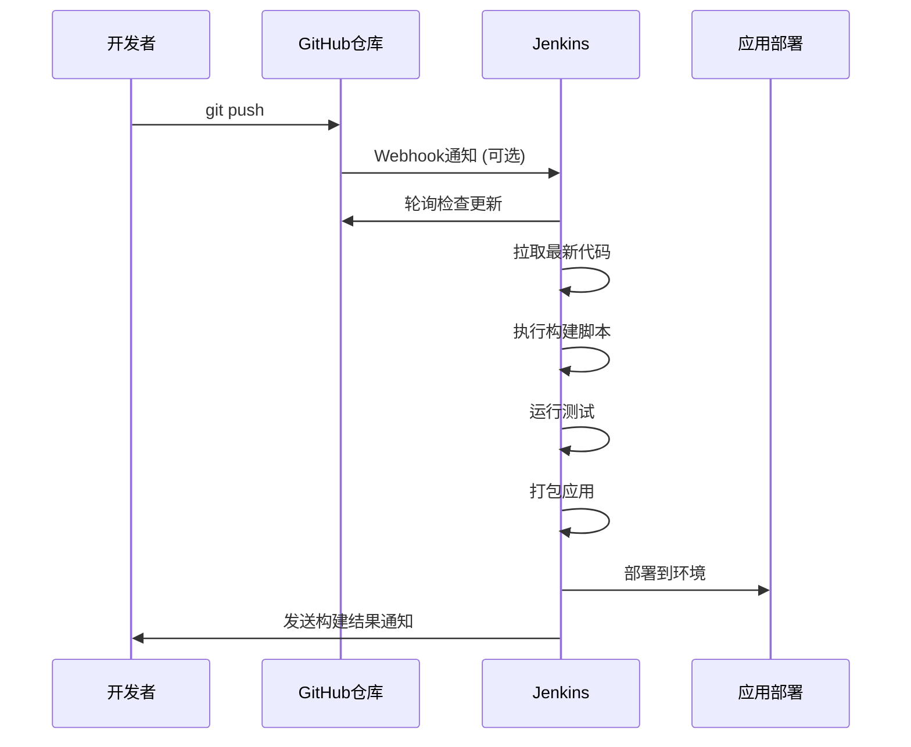
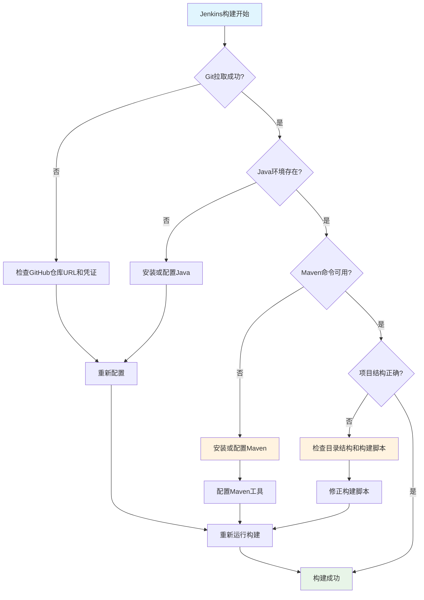

# 🚀 Jenkins GitHub 配置快速指南

## ✅ 您的当前状态
- [x] 代码已推送到GitHub
- [x] Jenkins已通过WSL2 docker-compose安装
- [ ] 需要配置Jenkins的Source Code Management

## 📋 Jenkins配置步骤

### 1. 在Jenkins中创建Freestyle项目

1. 打开Jenkins控制台：`http://localhost:8080`
2. 点击 **"New Item"**
3. 输入项目名称：`microservices-training`
4. 选择 **"Freestyle project"**
5. 点击 **"OK"**

### 2. 配置Source Code Management

在项目配置页面的 **"Source Code Management"** 部分：

#### 基本配置：
```
📍 选择: Git
📍 Repository URL: https://github.com/YOUR_USERNAME/YOUR_REPO_NAME.git
📍 Credentials: 
   - 如果是公开仓库：选择 "- none -"
   - 如果是私有仓库：需要配置GitHub Token
📍 Branches to build: */main
```

### 3. 如果是私有仓库，需要配置GitHub Token

#### 创建GitHub Token：
1. 访问：https://github.com/settings/tokens
2. 点击 **"Generate new token (classic)"**
3. 勾选权限：`repo` (Full control of private repositories)
4. 复制生成的token

#### 在Jenkins中添加凭证：
1. Jenkins Dashboard → **"Manage Jenkins"** → **"Manage Credentials"**
2. 选择 **"(global)"** domain → **"Add Credentials"**
3. 配置：
   ```
   Kind: Username with password
   Username: 您的GitHub用户名
   Password: 刚才复制的GitHub token
   ID: github-credentials
   Description: GitHub Access Token
   ```

### 4. 配置构建触发器

在 **"Build Triggers"** 部分勾选：
- ✅ **"Poll SCM"**: `H/5 * * * *` (每5分钟检查代码变更)
- ✅ **"GitHub hook trigger for GITScm polling"** (支持Webhook)

### 5. 配置构建步骤

在 **"Build"** 部分，点击 **"Add build step"** → **"Execute shell"** (如果Jenkins在Linux/WSL中) 或 **"Execute Windows batch command"**：

#### For Linux/WSL Jenkins:
```bash
#!/bin/bash
echo "开始微服务构建流水线..."

# 显示环境信息
echo "Java版本:"
java -version
echo "Maven版本:"
mvn -version

# 构建所有微服务
echo "构建Gateway Service..."
cd gateway-service && mvn clean compile && cd ..

echo "构建User Service..."
cd user-service && mvn clean compile && cd ..

echo "构建Product Service..."  
cd product-service && mvn clean compile && cd ..

# 运行测试
echo "运行测试..."
mvn test

# 打包
echo "打包应用..."
mvn clean package -DskipTests

echo "构建完成！"
```

### 6. 保存并测试

1. 点击 **"Save"**
2. 在项目页面点击 **"Build Now"**
3. 查看 **"Console Output"** 检查构建结果

## 🎯 配置完成后的工作流程



## 🔧 常见问题解决

### 问题诊断流程图



### Q: Jenkins无法访问GitHub仓库
**解决方案**: 
- 检查网络连接
- 确认仓库URL正确
- 如果是私有仓库，检查GitHub Token权限

### Q: 构建失败 - Maven命令找不到
**解决方案**:
```bash
# 方案1: 在Jenkins中配置Maven工具
# Dashboard → Manage Jenkins → Global Tool Configuration → Maven

# 方案2: 在构建脚本中使用完整路径
/usr/local/maven/bin/mvn clean compile

# 方案3: 在Docker容器中安装Maven
docker exec jenkins-container apt-get update && apt-get install -y maven
```

### Q: 找不到微服务目录 (user-service, product-service)
**解决方案**:
```bash
# 检查当前目录结构
ls -la

# 如果项目结构不同，需要修改构建脚本
# 根据实际目录结构调整路径
```

### Q: Java版本不匹配
**解决方案**:
- 在Jenkins中配置JDK工具
- 或在构建脚本中设置JAVA_HOME

## 🔧 针对当前问题的修复方案

### 1. 配置Maven工具

#### 方案A: 在Jenkins中配置Maven (推荐)

1. **Dashboard** → **Manage Jenkins** → **Global Tool Configuration**
2. 找到 **Maven** 部分
3. 点击 **Add Maven**
4. 配置:
   ```
   Name: Maven-3.8.6
   Install automatically: ✅
   Version: 选择最新版本
   ```
5. **Save**

#### 方案B: 在Docker容器中安装Maven

```bash
# 进入Jenkins容器
docker exec -u root -it jenkins-container bash

# 安装Maven
apt-get update
apt-get install -y maven

# 验证安装
mvn -version
```

### 2. 修正构建脚本

基于您的项目结构，更新构建脚本:

## 🎉 下一步

配置完成后，您就可以：
1. ✅ 每次推送代码到GitHub时自动触发构建
2. ✅ 查看构建历史和结果
3. ✅ 接收构建失败通知
4. ✅ 继续学习Jenkins的高级功能

**现在您可以继续第5课的后续内容了！**